# D-P-001 Level 1 — Introduction to Design & Prototyping


## Table of Contents

1. [Task 1 — 3D Printing](#task-1)
2. [Task 2 — API](#task-2)
3. [Task 3 — GitHub](#task-3)
4. [Task 4 — Ubuntu CLI](#task-4)
5. [Task 7 — Portfolio Webpage](#task-7)
6. [Task 8 — Markdown Article](#task-8)
7. [Task 9 — Tinkercad](#task-9)
8. [Task 10 — DC Motor Control](#task-10)
9. [Task 11 — ESP32 LED Toggle](#task-11)
10. [Task 12 — Soldering](#task-12)
11. [Task 13 — 555 Timer](#task-13)
12. [Task 14 — Burglar Alarm](#task-14)
13. [Task 15 — Active Participation](#task-15)
14. [Task 16 — L293D Datasheet Report](#task-16)
15. [Task 17 — Introduction to VR](#task-17)
16. [Task 18 — Sad Servers](#task-18)

---

<a name="task-1"></a>
# Task 1 — 3D Printing

## Objective
Understand the working of a 3D printer, learn about STL files, slicing
and printer settings. Design and print a 3D object.

## What I Did
3D printing is bringing a virtual design to real life. I learned how
STL files are exported from design software and imported into a slicer.
The slicer converts the model into layers and generates instructions for
the printer.

I designed and 3D printed a miniature model of the **Minchu building**
at MARVEL lab using the **Bambu Lab 3D printer**.

**Key settings learned:**
- **Infill** — Controls how hollow or solid the print is
- **Supports** — Added for floating parts
- **Layer height** — Thinner = smoother but slower
- **PLA filament** — Most common, cheap and biodegradable

## Outcome
Successfully printed the Minchu model. Learned slicing, infill settings,
PLA filament properties and Bambu Lab printer basics.

## Pics
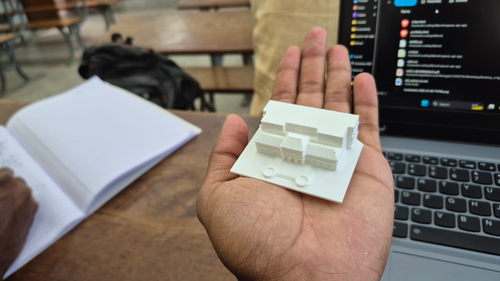
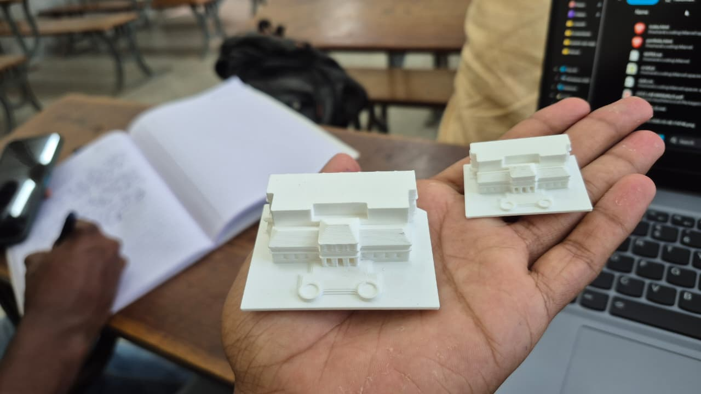

---

<a name="task-2"></a>
# Task 2 — API

## Objective
Understand what an API is and build a web app that makes API calls
and displays information.

## What I Did
An API (Application Programming Interface) is a messenger between two
applications. I built a **live Currency Converter** using the
**ExchangeRate API** that fetches real time exchange rates.

**How the API call works:**
````javascript
const res = await fetch(
  `https://api.exchangerate-api.com/v4/latest/${fromCurrency}`
);
const data = await res.json();
const rate = data.rates[toCurrency];
const result = amount * rate;
````

**Features:**
- Convert between 11 major currencies
- Live exchange rates fetched in real time
- Swap button to reverse conversion
- Quick conversion chips for popular pairs

**API Used:** https://api.exchangerate-api.com/v4/latest/USD

## Outcome
Built a functional currency converter web app. Learned how APIs work,
how to make HTTP requests using fetch() and how to parse JSON data.

## Pics
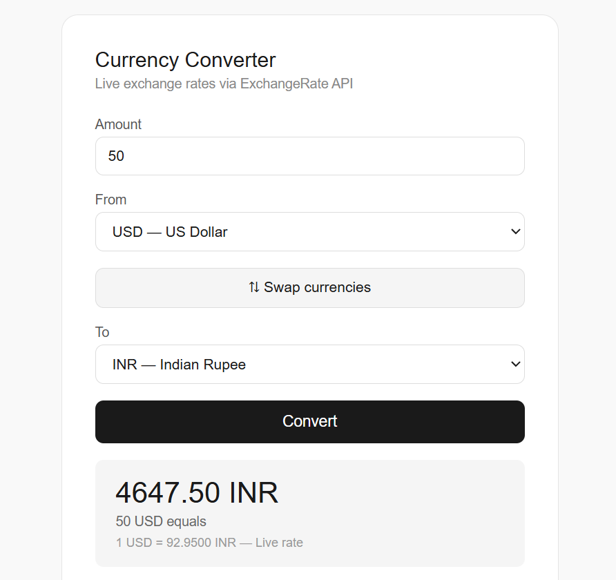

---

<a name="task-3"></a>
# Task 3 — Working with GitHub

## Objective
Learn GitHub workflows — forking, issues and pull requests.

## What I Did
GitHub is like Instagram for coders — a platform to share and
collaborate on code. I followed the README instructions on the MARVEL
git-task repository.

**Steps:**
1. Read the README on UVCE-Marvel/git-task
2. Forked the repository to my account
3. Found bug in `main.py` — extra `+1` in add function:
````python
# Buggy code
return number_a + number_b + 1

# Fixed code
return number_a + number_b
````
4. Raised Issue **#272** — "Bug: add function returns wrong value"
5. Opened Pull Request **#273** — no conflicts with base branch

**Links:**
- Fork: https://github.com/prajwaldhannur4-code/git-task
- Issue #272: https://github.com/UVCE-Marvel/git-task/issues/272
- PR #273: https://github.com/UVCE-Marvel/git-task/pull/273

## Outcome
Learned the complete GitHub open source workflow — fork, fix, issue
and pull request.

---

<a name="task-4"></a>
# Task 4 — Ubuntu CLI

## Objective
Get familiar with the Linux command line on Ubuntu.

## What I Did
The command line is a text interface to interact with the computer.
I performed the following tasks on Ubuntu terminal:
````bash
# Create test folder and navigate
mkdir test
cd test

# Create blank file
touch myfile.txt

# Create 2600 folders
for i in $(seq 1 100); do mkdir A$i; done
# repeated for all 26 letters
ls | wc -l  # Output: 2601

# Concatenate two files
echo "Hello I am learning Linux commands." > file1.txt
echo "This is the second file with more text." > file2.txt
cat file1.txt file2.txt
````

**Commands learned:**

| Command | Purpose |
|---|---|
| `mkdir` | Create directory |
| `cd` | Change directory |
| `touch` | Create blank file |
| `ls` | List files |
| `cat` | Display/concatenate files |
| `wc -l` | Count lines/items |

## Outcome
Learned how to navigate and operate the Linux file system using
terminal commands efficiently.

## Pics
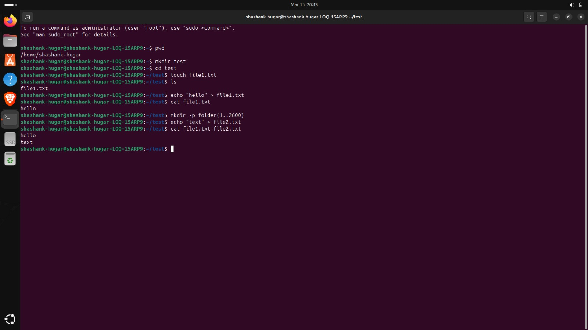

---

<a name="task-7"></a>
# Task 7 — Portfolio Webpage

## Objective
Create a responsive personal portfolio website pushed to GitHub.

## What I Built
A fully responsive personal portfolio webpage using HTML and CSS
showcasing my projects, achievements and interests.

**Sections included:**
- Hero section with name and badges
- About Me
- Projects — RC Plane, Maze Robot, Minchu 3D Print, Currency Converter
- Achievements — Mecronin 2nd place, IISc certificate, MARVEL
- Connect — GitHub link

**Technologies used:** HTML, CSS, Flexbox, CSS Grid, GitHub Pages

**Live link:** https://prajwaldhannur4-code.github.io/MARVEL-Level1-Report

## Outcome
Learned HTML/CSS basics, responsive design and how to host a webpage
on GitHub Pages.

## Pics
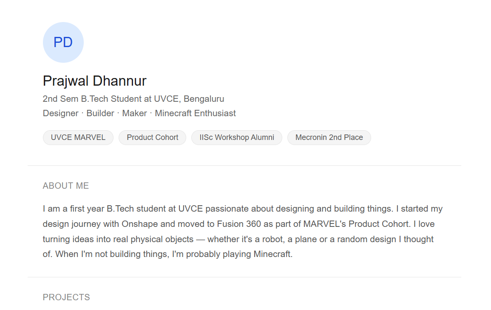
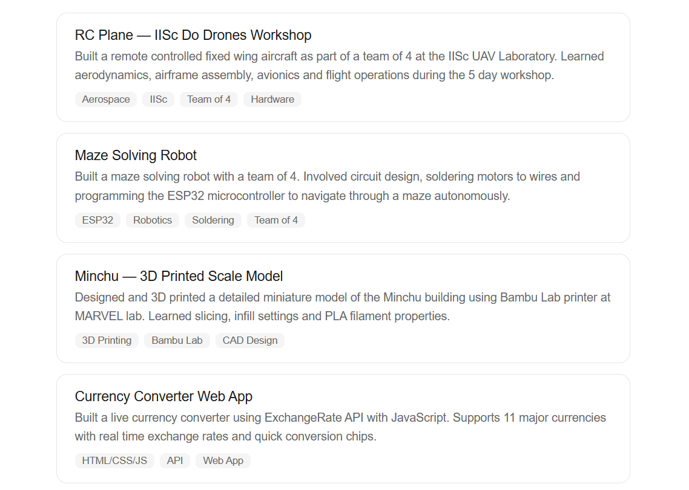
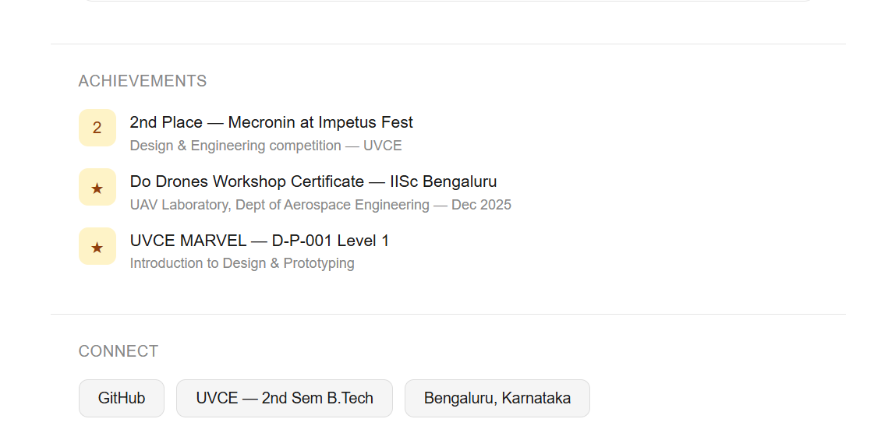

---

<a name="task-8"></a>
# Task 8 — Markdown Article

## Objective
Write a technical resource article using Markdown and post it on
the MARVEL website.

## What I Did
Markdown is a lightweight markup language that adds formatting to
plain text. I wrote a technical article on **Introduction to 3D Printing**
covering types of 3D printing, STL files, slicing and applications.

**Markdown syntax learned:**
- `#` for headings
- `**text**` for bold
- `-` for bullet points
- ` ``` ` for code blocks
- `[text](url)` for links
- `` for images

## Outcome
Learned Markdown syntax and wrote a complete technical article
posted on the MARVEL website.

---

<a name="task-9"></a>
# Task 9 — Tinkercad

## Objective
Simulate an ultrasonic sensor circuit and a radar system on Tinkercad.

## What I Did
Tinkercad is a free online simulation platform by Autodesk for circuits
and 3D design. I built two circuits:

**Circuit 1 — Ultrasonic Distance Sensor:**
- Arduino UNO + Ultrasonic Sensor on Pin 9
- Measures distance using sound waves
- Formula: `Distance = Duration × 0.034 / 2`
- Serial Monitor shows: `Distance: 78 cm`

**Circuit 2 — Radar System:**
- Arduino UNO + Ultrasonic Sensor + Servo Motor
- Servo rotates 0° to 180° continuously
- Sensor measures distance at every angle
- Serial Monitor shows: `Angle: 45 | Distance: 38 cm`

## Outcome
Learned Tinkercad simulation, how ultrasonic sensors work using sound
waves and how servo motors rotate to precise angles.

## Pics
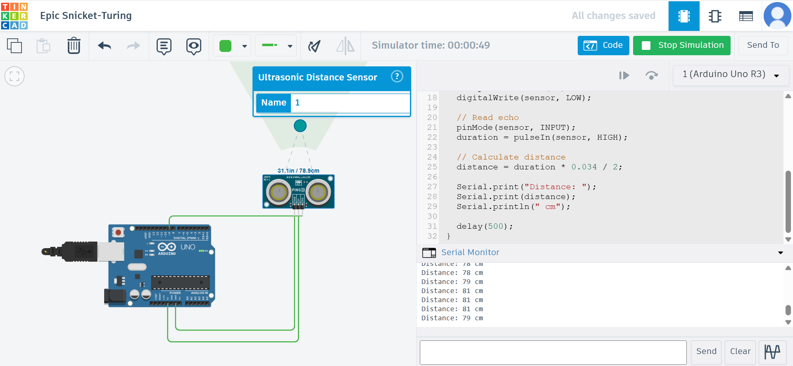
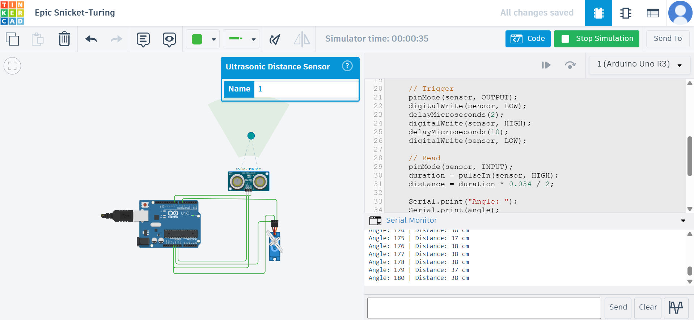

---

<a name="task-10"></a>
# Task 10 — Speed Control of DC Motor

## Objective
Control DC motor speed using L298N motor driver and Arduino UNO.

## What I Did
The L298N motor driver connects Arduino to a DC motor. Arduino sends
PWM signals to control motor speed:
- **255 PWM** = full speed
- **128 PWM** = half speed
- **0 PWM** = stop

I connected L298N + BO motor + potentiometer to Arduino. When I rotated
the potentiometer the motor speed changed in real time. Motor started
spinning when voltage exceeded 7V.

**Connections:**

| L298N | Arduino |
|---|---|
| IN1 | Pin 8 |
| IN2 | Pin 9 |
| ENA (PWM) | Pin 10 |

## Outcome
Successfully controlled DC motor speed using PWM and potentiometer.
Learned how L298N works and why motors need driver ICs.

## Pics
🎥 [DC Motor Speed Control Video](pics/speed_control_of_dc_motor.mp4)

---

<a name="task-11"></a>
# Task 11 — LED Toggle Using ESP32

## Objective
Create a web server on ESP32 to control an LED from a browser.

## What I Did
ESP32 is more powerful than Arduino with built in WiFi and Bluetooth.
I built a circuit with ESP32 + LED + resistor. After uploading the
web server code, the ESP32 generated an IP address. Opening this IP
in a browser showed ON/OFF buttons that controlled the LED wirelessly.

**How it works:**
```
Browser → Types IP address → ESP32 Web Server
→ Receives ON/OFF → GPIO goes HIGH/LOW → LED ON/OFF
```

## Outcome
Successfully toggled LED from browser wirelessly. Learned ESP32 web
server, GPIO control and IoT fundamentals.

## Pics
🎥 [ESP32 LED Toggle Video](pics/LED_light_toggle.mp4)

---

<a name="task-12"></a>
# Task 12 — Soldering

## Objective
Learn soldering equipment and perform basic soldering on a perf board.

## What I Did
Soldering joins electronic components permanently using melted solder
wire. I have done soldering many times including when I built a maze
solving robot where I soldered motors to wires.

For this task I soldered a basic LED circuit on a perf board at MARVEL
lab under coordinator supervision.

**Equipment used:**
- Soldering iron, solder wire, flux, soldering wick, perf board

## Outcome
Learned proper soldering technique and safety. Can confidently solder
components for real hardware projects.

## Pics


---

<a name="task-13"></a>
# Task 13 — 555 Astable Multivibrator

## Objective
Design a 555 astable multivibrator with 60% duty cycle and observe
output on DSO.

## What I Did
The 555 timer in astable mode generates a continuous square wave.
Duty cycle is the percentage of time the signal stays HIGH.

**Formula:**
```
Duty Cycle = (R1 + R2) / (R1 + 2×R2) × 100%
```

**Values used:**
- R1 = 4.7kΩ, R2 = 10kΩ, C = 10µF
- Duty Cycle = (4.7 + 10) / (4.7 + 20) × 100 = **59.19%**

59.19% is the closest achievable value to 60% using standard
resistor values. I verified this on the DSO oscilloscope.

## Outcome
Built 555 astable circuit and verified 59.19% duty cycle on DSO.
Learned how to use oscilloscope and calculate duty cycle.

## Pics


---

<a name="task-14"></a>
# Task 14 — Karnaugh Maps and Burglar Alarm

## Objective
Use K-maps to derive logic circuit and build a burglar alarm.

## What I Did
A K-Map simplifies Boolean expressions visually by grouping 1s.

**Truth Table:**

| Door (D) | Key (K) | Alarm |
|---|---|---|
| 0 | 0 | 0 |
| 0 | 1 | 0 |
| 1 | 0 | 1 ← ALARM |
| 1 | 1 | 0 |

**K-Map:**
```
         K=0    K=1
D=0  |   0   |   0   |
D=1  |   1   |   0   |
````

**Result: Alarm = D · K'** (Door open AND Key NOT pressed)

**Logic circuit:** Door → AND gate ← NOT gate ← Key → Buzzer/LED

I built this on Arduino with 2 push buttons. Pressing Door button
only triggers the alarm. Pressing Key button cancels it.

## Outcome
Learned K-maps, Boolean simplification and logic gate implementation.
Built working burglar alarm on hardware.

## Pics


---

<a name="task-15"></a>
# Task 15 — Active Participation

## Objective
Participate in a technical event and submit certificate.

## What I Did
I participated in the **Do Drones Workshop** at IISc Bengaluru conducted
by the UAV Laboratory, Department of Aerospace Engineering under the
**SwaYaan initiative** by MeitY.

**Duration:** 09 — 13 December 2025

**Topics covered:**
- Introduction to UAVs
- Aerodynamics, Multicopter and Fixed Wing Design
- Airframe, Avionics, Propulsion and Control Systems
- Multirotor Assembly and Flight Simulator Training
- Mission Planning and Supervised Flight Operations

**Certificate Ref:** RefSDC/2025-26/DODRONES-34

## Outcome
Got hands on experience in drone assembly and flight simulation at
India's premier science institute.

## Pics
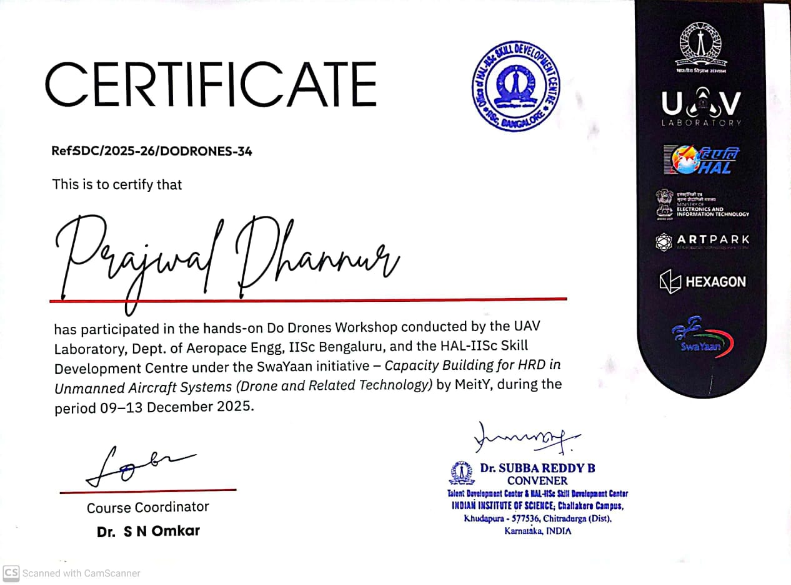
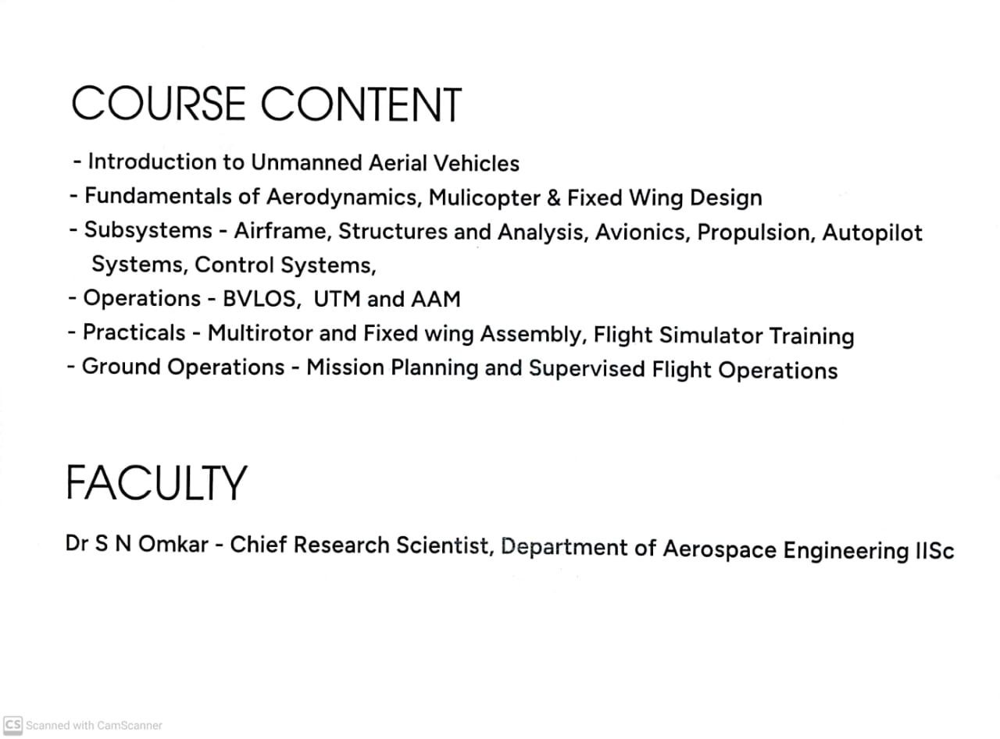

---

<a name="task-16"></a>
# Task 16 — L293D Datasheet Report

## Objective
Study the L293D motor driver datasheet and write a detailed report.

## What I Did
The L293D is a dual H-Bridge motor driver IC by Texas Instruments that
controls two DC motors simultaneously.

**H-Bridge** — 4 switches arranged like letter H allowing current to
flow in both directions through the motor giving forward/reverse control.

**PWM** — Pulse Width Modulation controls motor speed by switching
power ON and OFF rapidly. Duty cycle controls average voltage.

**Key pins:**
- EN1, EN2 — Enable pins for PWM speed control
- A1, A2 — Input pins for direction control
- Y1, Y2 — Output pins connecting to motor
- VCC1 — 5V logic supply
- VCC2 — Motor supply (4.5V to 36V)

**Specs:** 600mA continuous, 1.2A peak, built in flyback diodes

## Outcome
Understood H-Bridge, PWM, pin configuration and protection diodes
of L293D. Essential knowledge for motor control in robotics.

---

<a name="task-17"></a>
# Task 17 — Introduction to VR

## Objective
Study Virtual Reality, differences between VR and AR, trends and
Indian companies in the space.

## What I Did

**VR (Virtual Reality)** — Fully immersive digital world. Cuts off
real world completely. Requires headset like Meta Quest or HTC Vive.
Example: Playing games in different dimensions.

**AR (Augmented Reality)** — Adds virtual objects on top of real world.
Real world still visible. Works on smartphones.
Example: Pokemon GO, Snapchat filters.

**MR (Mixed Reality)** — Combines both VR and AR. Best example:
Apple Vision Pro.

**VR vs AR vs MR:**

| Feature | VR | AR | MR |
|---|---|---|---|
| Real world visible | No | Yes | Yes |
| Hardware | Headset | Smartphone | Advanced headset |
| Immersion | Full | Partial | Full + Real |

**Trends:** Metaverse, standalone headsets, VR in healthcare and
education, eye tracking, foveated rendering.

**Indian Companies:**

| Company | What they do |
|---|---|
| AjnaLens | India's own AR headset — used by Indian Army! |
| Simulanis | VR training for manufacturing |
| Scapic | AR for e-commerce — acquired by Flipkart |

## Outcome
Understood VR, AR and MR differences, technology stack and India's
growing role in the VR space.

---

<a name="task-18"></a>
# Task 18 — Sad Servers

## Objective
Solve the Command Line Murders scenario on Sad Servers platform.

## What I Did
Sad Servers is like LeetCode for Linux. I solved the Command Line
Murders mystery using Linux commands.

**Key steps:**
````bash
cd /home/admin/clmystery/mystery
cat crimescene          # Read clues
grep "Annabel" people   # Find witness
grep -rl "Annabel Sun" people  # Find her ID
cat interviews/interview-[ID]  # Read interview
grep [clues] vehicles   # Find suspect
echo [NAME] | md5sum    # Verify answer
````

**Commands used:** `cat`, `grep`, `grep -r`, `grep -l`, `ls`, `cd`,
`echo`, `md5sum`

## Outcome
Learned how to use grep and other Linux commands to search and process
text files. Solved the mystery using command line tools only.

## Pics


---

*Report by: Prajwal Dhannur*

*GitHub: https://github.com/prajwaldhannur4-code/MARVEL-Level1-Report*
