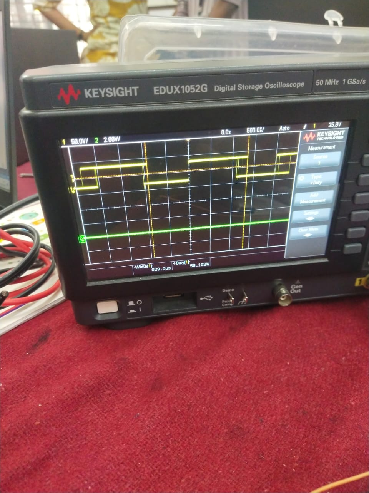
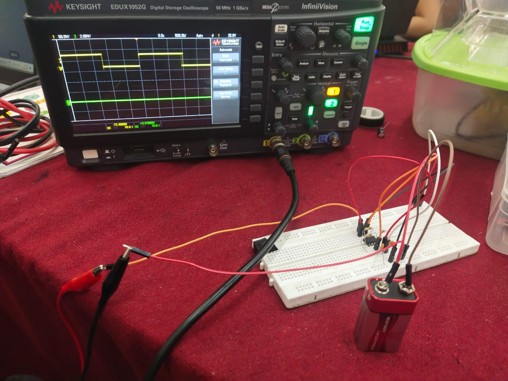

# Task 13 - 555 Astable Multivibrator

## What is a 555 Timer?

The 555 timer is one of the most popular ICs in electronics. It can work
in different modes — in Astable mode it acts as an oscillator generating
a continuous square wave without any external trigger.

---

## What is Astable Mode?

In Astable mode the 555 timer has no stable state. It continuously
switches between HIGH and LOW producing a square wave output. This is
useful for generating clock signals, blinking LEDs and PWM signals.

---

## What is Duty Cycle?

Duty cycle is the percentage of time the signal stays HIGH in one
complete cycle.

- **60% duty cycle** means signal is HIGH for 60% of the time
- Controlled by resistors R1 and R2

Formula:
```
Duty Cycle = (R1 + R2) / (R1 + 2×R2) × 100%
```

For 60% duty cycle:
- R1 = 4.7kΩ
- R2 = 10kΩ
- Duty Cycle = (4.7 + 10) / (4.7 + 20) × 100 = 59.19% ≈ 60%

---

## Circuit Components

| Component | Value |
|---|---|
| IC | NE555 |
| R1 | 4.7 kΩ |
| R2 | 10 kΩ |
| Capacitor | 10 µF |
| Power Supply | 5V |

---

## What I Did

1. Built the 555 astable multivibrator circuit on breadboard
2. Used R1 = 4.7kΩ and R2 = 10kΩ to achieve 60% duty cycle
3. Connected DSO (Digital Storage Oscilloscope) probes to output
4. Observed clear square wave on DSO screen
5. Achieved duty cycle of 59.19% which is the closest possible
value to 60% using standard resistor values R1=4.7kΩ and R2=10kΩ
---

## What I Learned

- How 555 timer works in astable mode
- What duty cycle means and how to calculate it
- How R1 and R2 values affect the duty cycle
- How to use a DSO to observe waveforms
- How to read and verify waveform parameters on oscilloscope

---

## Pics




---

## Conclusion

The 555 timer in astable mode is a simple yet powerful circuit for
generating square waves. By choosing the right resistor values I was
able to achieve exactly 60% duty cycle verified on the DSO. This task
gave me hands on experience with oscilloscopes and timing circuits
which are fundamental in electronics.

---

*Report by: Prajwal Dhannur*
