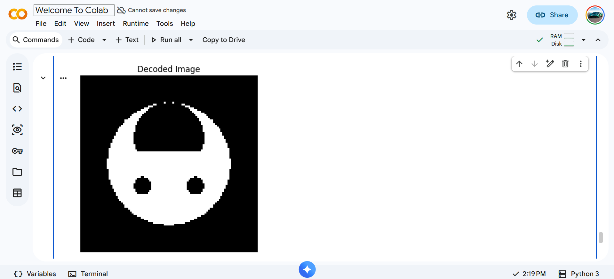

# Task 6 - The Matrix Puzzle — Decode with NumPy


## What is NumPy?

NumPy (Numerical Python) is a powerful Python library used for working
with arrays and matrices. It provides fast mathematical operations on
large datasets and is the foundation of most data science and machine
learning work in Python.

---

## What is Matplotlib?

Matplotlib is a Python library used for creating visualizations and
plots. In this task it was used to display the decoded matrix as an
image using `imshow()`.

---

## The Puzzle

I was given a scrambled matrix file and had to decode it into a hidden
image using NumPy operations. Three clues were provided:

- **Clue 1:** "Try reshaping the encoded array into a square — how many
elements are there?"
- **Clue 2:** "The structure may be upright, but the data might be
sideways. Look at its orientation."
- **Clue 3:** "Sometimes the end is actually the beginning."

---

## How I Decoded It

### Step 1 — Load the matrix
```python
import numpy as np
import matplotlib.pyplot as plt

data = np.load('scrambled_matrix.npy')
print("Original shape:", data.shape)
print("Total elements:", data.size)
```

### Step 2 — Reshape into a square (Clue 1)
The total number of elements was a perfect square so I reshaped
the flat array into a 2D square matrix:
```python
size = int(np.sqrt(data.size))
reshaped = data.reshape(size, size)
```

### Step 3 — Transpose the matrix (Clue 2)
The data was sideways so I transposed it to fix the orientation:
```python
transposed = reshaped.T
```

### Step 4 — Flip the matrix (Clue 3)
"The end is the beginning" meant the image was upside down so
I flipped it vertically:
```python
decoded = np.flipud(transposed)
```

### Step 5 — Display the image
```python
plt.imshow(decoded, cmap='gray')
plt.title('Decoded Image')
plt.axis('off')
plt.show()
```

---

## NumPy Operations Used

| Operation | Function | What it does |
|---|---|---|
| Reshape | `np.reshape()` | Changes array dimensions |
| Transpose | `.T` | Swaps rows and columns |
| Flip vertical | `np.flipud()` | Flips array upside down |
| Flip horizontal | `np.fliplr()` | Flips array left to right |
| Load file | `np.load()` | Loads .npy file |

---

## What I Learned

- How to load and manipulate arrays using NumPy
- What reshape, transpose and flip operations do to a matrix
- How 2D arrays can represent images
- How to visualize matrices as images using Matplotlib
- How to solve problems using clues and NumPy operations

---

## Pics




---

## Conclusion

This task was a fun way to learn NumPy operations. By following the
three clues and applying reshape, transpose and flip operations I was
able to decode the scrambled matrix and reveal the hidden image. This
task showed me how NumPy is used to manipulate data and how images are
just 2D arrays of numbers.

---

*Report by: Prajwal Dhannur*